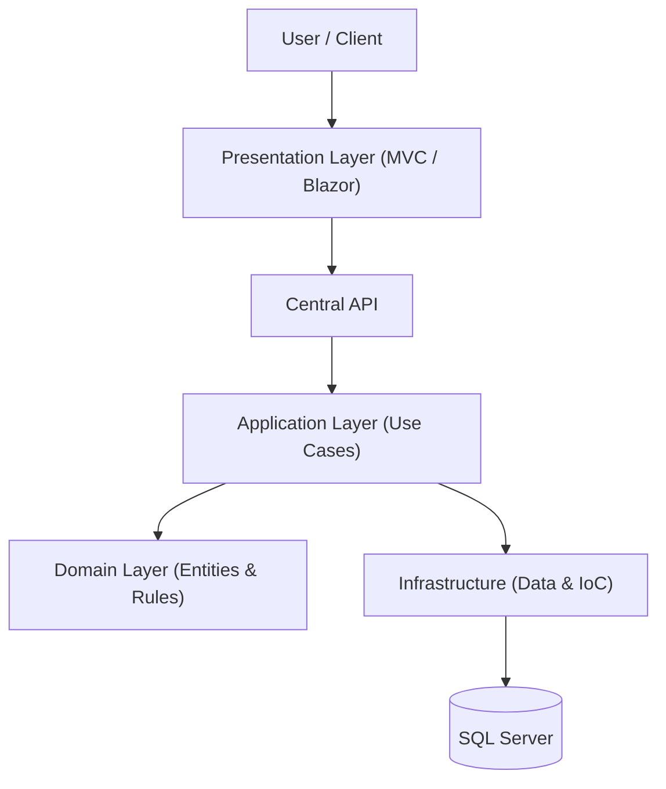

# EAM Company - Enterprise Platform

  

The official monolithic platform for **EAM Company**, orchestrating the Institutional Website, Client Portal, and Central API.
Designed to showcase high-level software engineering capabilities using the full Microsoft Stack.

## 🏗️ Architectural Overview

This solution follows the **Clean Architecture** principles, enforcing strict separation of concerns and dependency rules.

📂 Solution Structure
1. Core (The Heart)

EAM.Core.Domain: Enterprise logic, Entities (POCOs), and Repository Interfaces. No external dependencies.

EAM.Core.Application: Business logic, Services, DTOs, and Validators.

2. Infrastructure

EAM.Infra.Data: EF Core Context, Migrations, and Repository Implementations.

EAM.Infra.IoC: Dependency Injection Native Injector.

3. Presentation

EAM.Web.Public: ASP.NET Core MVC (Institutional Site & SEO).

EAM.Web.Portal: Blazor Server (Client Dashboard & SaaS Management).

EAM.Web.API: RESTful API serving mobile apps and integrations.

🛠️ Tech Stack
Backend: C# 12, ASP.NET Core Web API

Frontend A (Public): ASP.NET MVC, Razor Views, Bootstrap/Tailwind

Frontend B (Private): Blazor Server

Data: Entity Framework Core, SQL Server

Auth: ASP.NET Core Identity (Roles & Claims)

Design Patterns: Repository, Unit of Work, Dependency Injection, CQRS (Future).

📄 License
This project is proprietary software. Copyright © 2025 Emanuel Arrudas de Macêdo. All Rights Reserved. See LICENSE for details.
