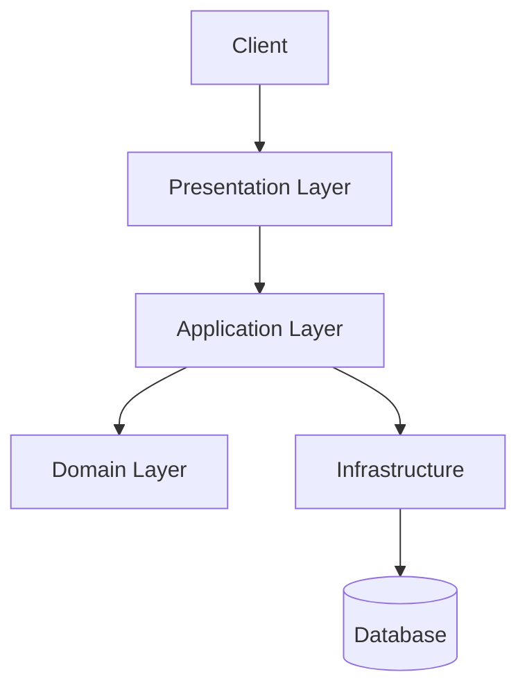

# EAM Company - Enterprise Platform

  

Enterprise platform for **EAM Company** built with Clean Architecture principles.

> ⚠️ **NOTICE**: This is proprietary software. Unauthorized use, reproduction, or distribution is strictly prohibited.

---

## 🏗️ Architecture

This solution follows **Clean Architecture** principles with strict separation of concerns:



---

## 📂 Project Structure

```
dotnet-platform-eam-company/
├── src/
│   ├── 1.Core/
│   │   ├── EAM.Core.Domain/
│   │   └── EAM.Core.Application/
│   ├── 2.Infrastructure/
│   │   ├── EAM.Infra.Data/
│   │   └── EAM.Infra.IoC/
│   └── 3.Presentation/
│       ├── EAM.Web.API/
│       ├── EAM.Web.Public/
│       └── EAM.Web.Portal/
└── tests/
    └── EAM.Core.UnitTests/
```

### Layers

#### 1. Core Layer
- **Domain**: Business entities and domain logic
- **Application**: Use cases and business rules

#### 2. Infrastructure Layer
- **Data**: Data access with Entity Framework Core
- **IoC**: Dependency injection configuration

#### 3. Presentation Layer
- **API**: RESTful web services
- **Public**: Institutional website
- **Portal**: Client area

---

## 🛠️ Technology Stack

- **.NET 10.0** - Modern framework
- **ASP.NET Core** - Web applications
- **Blazor Server** - Interactive UI
- **Entity Framework Core** - ORM
- **SQL Server** - Database
- **Docker** - Containerization

---

## 📄 License

**Copyright © 2025 Emanuel Arrudas de Macêdo - EAM Company**

This is proprietary and confidential software. All rights reserved.

Unauthorized copying, distribution, modification, or use of this software, 
via any medium, is strictly prohibited without explicit written permission.

See [LICENSE](LICENSE) for full terms.

---

## 👨‍💻 Author

**Emanuel - EAM Company**

- Website: [eam-company.com.br](https://eam-company.com.br)
- GitHub: [@ContatoEmanuel](https://github.com/ContatoEmanuel)